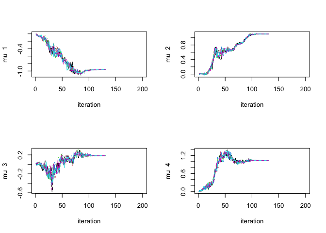

<!-- README.md is generated from README.Rmd. Please edit that file -->

# graDiEnt

<!-- badges: start -->

<!-- badges: end -->

This package makes accessible the the Stochastic Quasi-Gradient
Differential Evolution Optimization algorithm first published by Sala,
Baldanzini, and Pierini (2018). This optimization algorithm fuses the
robustness of the population-based global optimization algorithm
“Differential Evolution” with the efficiency of gradient-based
optimization. The derivative-free algorithm uses population members to
build stochastic gradient estimates, without any additional objective
function evaluations. Sala, Baldanzini, and Pierini argue this algorithm
is useful for ‘difficult optimization problems under a tight function
evaluation budget.’ This package can run SQG-DE in parallel and
sequentially.

## Installation

<!-- You can install the released version of graDiEnt from [CRAN](https://CRAN.R-project.org) with: -->

<!-- ``` r -->

<!-- install.packages("graDiEnt") -->

<!-- ``` -->

<!-- And the development version from [GitHub](https://github.com/) with: -->

``` r
# install.packages("devtools")
devtools::install_github("bmgaldo/graDiEnt")
```

## Example

This is a basic application of the package to a toy optimization
problem.

``` r
library(graDiEnt)
set.seed(123)
##############
# Maximum Likelihood Example
##############

# simulate from model
dataExample=matrix(rnorm(100,c(-1,1,0,1),c(1,1,1,1)),ncol=4,byrow = TRUE)

# list parameter names
param_names_example=c("mu_1","mu_2","mu_3","mu_4")

# negative log likelihood
ExampleObjFun=function(x,data,param_names){
  out=0

  names(x) <- param_names

  # log likelihoods
  out=out+sum(dnorm(data[,1],x["mu_1"],sd=1,log=TRUE))
  out=out+sum(dnorm(data[,2],x["mu_2"],sd=1,log=TRUE))
  out=out+sum(dnorm(data[,3],x["mu_3"],sd=1,log=TRUE))
  out=out+sum(dnorm(data[,4],x["mu_4"],sd=1,log=TRUE))

  return(out*-1)
}

########################
# run optimization
out <- optim_SQGDE(ObjFun = ExampleObjFun,
                   control_params = GetAlgoParams(n_params=length(param_names_example),
                                             n_iter = 200,
                                              n_particles = 12,
                                              n_diff = 2,
                                              return_trace = TRUE),
                   data = dataExample,
                   param_names = param_names_example)
#> [1] "initalizing population..."
#> [1] "1 / 12"
#> [1] "2 / 12"
#> [1] "3 / 12"
#> [1] "4 / 12"
#> [1] "5 / 12"
#> [1] "6 / 12"
#> [1] "7 / 12"
#> [1] "8 / 12"
#> [1] "9 / 12"
#> [1] "10 / 12"
#> [1] "11 / 12"
#> [1] "12 / 12"
#> [1] "population initialization complete  :)"
#> [1] "running SQG-DE..."
#> [1] "iter 100/200"
#> [1] "Convergence criterion met. Stopping optimization early"
#> [1] "run complete!"

# plot particle trajectory
par(mfrow=c(2,2))
matplot(out$particles_trace[,,1],type='l',ylab="mu_1",xlab="iteration")
matplot(out$particles_trace[,,2],type='l',ylab="mu_2",xlab="iteration")
matplot(out$particles_trace[,,3],type='l',ylab="mu_3",xlab="iteration")
matplot(out$particles_trace[,,4],type='l',ylab="mu_4",xlab="iteration")
```



``` r

#SQG DE solution
out$solution
#> [1] -0.9623938  1.1032798  0.1835086  1.0376028

#analytic solution
apply(dataExample, 2, mean)
#> [1] -0.9625315  1.1031771  0.1835243  1.0374537
```
